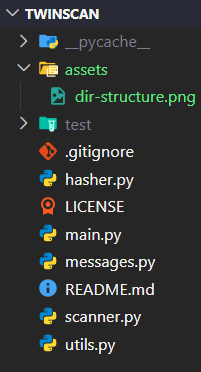

<h1 align="center">
  
</h1>

<p align="center"><i>Detect duplicates. Reclaim space.</i></p>

---

TwinScan is a **command-line duplicate file finder built in Python**, designed to identify identical files across directories using **SHA-256 hashing** and intelligent file-size-based optimization.

The project focuses on **Python fundamentals, file system traversal, hashing algorithms, performance optimization, modular software architecture, data processing, and practical utility development**, all implemented using Python's standard library.

> Note: TwinScan is designed as a learning-focused utility project and currently identifies duplicate files, estimates potential storage savings, and provides detailed scan statistics without modifying user files.

<p align="center">
  
</p>

<p align="center">
  
  
  
</p>

<p align="center">
  
</p>

<p align="center">
  
</p>

## Features

1. ### Recursive Directory Scanning

   * Recursively scans folders and subfolders
   * Detects files across nested directories
   * Validates user-specified paths
   * Handles scanning errors gracefully

2. ### SHA-256 Duplicate Detection

   * Generates SHA-256 hashes for files
   * Identifies identical file contents
   * Groups matching files together
   * Provides accurate duplicate detection

3. ### Optimized Scanning Engine

   * Uses file-size pre-filtering
   * Avoids unnecessary hashing operations
   * Improves scan performance
   * Reduces processing overhead

4. ### Storage Analysis

   * Calculates duplicate groups
   * Counts duplicate files
   * Estimates potential storage savings
   * Displays scan statistics

5. ### User Experience

   * Interactive menu-driven interface
   * Scan duration reporting
   * Clear success and error messages
   * Detailed duplicate group visualization

## Project Architecture

<p align="center">
  
</p>

## Sample Output

<p align="center">
  
</p>

## Tech Stack

<div align="center">

| Component               | Technology   |
| ----------------------- | ------------ |
| Language                | Python 3     |
| File System Operations  | os           |
| Hashing                 | hashlib      |
| Performance Measurement | time         |
| Version Control         | Git + GitHub |

</div>

## How TwinScan Works

```text
Directory
    ↓
Recursive File Scan
    ↓
File Size Grouping
    ↓
SHA-256 Hash Generation
    ↓
Duplicate Detection
    ↓
Storage Analysis
```

## Build & Run Instructions

### Requirements

* Python 3.10 or higher
* Git (for cloning the repository)

### Clone the Repository

```bash
git clone https://github.com/abhi-saurav-saroya/TwinScan.git
cd TwinScan
```

### Run the Application

```bash
python main.py
```

or

```bash
python3 main.py
```

### Usage

1. Launch TwinScan.
2. Select **Scan Directory** from the main menu.
3. Enter the directory path you want to scan.
4. Wait for the scan to complete.
5. View duplicate groups and storage statistics.
6. Analyze potential space savings.

<p align="center">
  
</p>

<div align="center">


<i>Built to learn, designed to optimize, engineered one scan at a time. 🔍</i>

<i>Detect duplicates. Reclaim space.</i>

<p align="center">
  
</p>

**© 2026 Open Source Project | TwinScan - Duplicate File Finder | MIT License**

</div>
